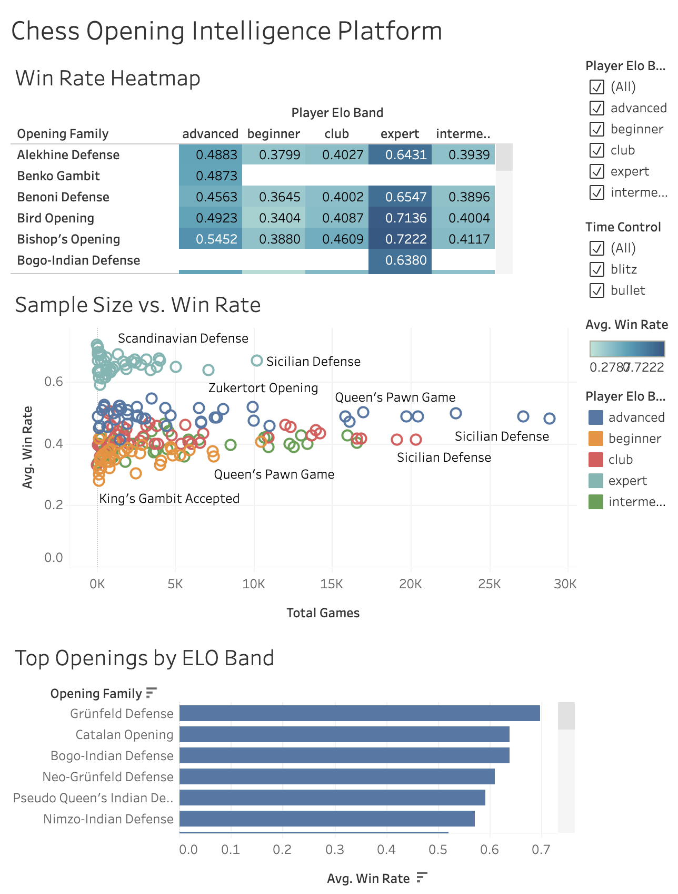

# Chess Opening Intelligence Platform

An end-to-end analytics pipeline that ingests 1M+ Lichess chess games from 4,563 players via streaming API, transforms raw game data through a layered dbt star schema in Supabase PostgreSQL, and delivers opening win-rate intelligence across 5 ELO bands via an automated weekly Dagster pipeline and interactive Tableau Public dashboard.

**[View Live Dashboard](https://public.tableau.com/views/ChessOpeningIntelligencePlatform/ChessOpeningIntelligencePlatform)**

---

## Project Overview

**Core Question:** Which chess openings maximize winning probability at each skill level, and does opening effectiveness differ between Bullet and Blitz?

**Key Findings:**
- The Blumenfeld Countergambit and Bogo-Indian Defense consistently outperform other openings at the expert level (2000+ ELO)
- Opening win rates vary significantly across ELO bands, with beginner players showing lower win rates across nearly all openings relative to expert players
- High-volume openings like the French Defense and Nimzowitsch Defense maintain stable win rates at scale, confirming statistical reliability
- Several openings (e.g. Blackmar-Diemer Gambit) show inflated win rates at low sample sizes, flagged via the sample size vs. win rate scatter view

---

## Architecture

```
Lichess API (NDJSON Stream)
        |
        v
Python Ingestion Scripts
(lichess_players.py, lichess_games.py)
        |
        v
Supabase PostgreSQL (raw schema)
raw.players | raw.games
        |
        v
dbt Transformation Layer
staging --> intermediate --> marts
        |
        v
Tableau Public Dashboard
```

---

## Tech Stack

| Layer | Tools |
|-------|-------|
| Ingestion | Python, requests, ndjson, SQLAlchemy |
| Storage | Supabase (PostgreSQL) |
| Transformation | dbt-core 1.8.2, dbt-postgres |
| Orchestration | Dagster (weekly cron) |
| Visualization | Tableau Public |

---

## Data

- **Players:** 4,563 Lichess players sampled across 5 ELO bands
- **Games:** 1M+ bullet and blitz games from 2024 to 2026
- **Source:** Lichess public API (streaming NDJSON)

### ELO Bands

| Band | Rating Range |
|------|-------------|
| Beginner | 400 to 999 |
| Intermediate | 1000 to 1299 |
| Club | 1300 to 1599 |
| Advanced | 1600 to 1999 |
| Expert | 2000+ |

---

## dbt Models

```
models/
├── staging/
│   ├── stg_games.sql          # Cleaned and typed game records
│   └── stg_players.sql        # Cleaned players with corrected ELO bands
├── intermediate/
│   ├── int_games_enriched.sql         # Games joined to player ELO band
│   └── int_opening_stats_by_band.sql  # Aggregated win rates by opening and band
└── marts/
    ├── fct_games.sql                  # Fact table, one row per game
    ├── dim_players.sql                # Player dimension
    ├── dim_openings.sql               # Opening reference dimension
    └── mart_opening_performance.sql   # Pre-aggregated Tableau serving layer
```

**Data Quality Tests:** 8 automated dbt tests covering uniqueness, null checks, and accepted values on game results, time controls, and player color.

---

## Dashboard Views



1. **Win Rate Heatmap** - Opening family vs. ELO band color matrix showing win rate intensity
2. **Sample Size vs. Win Rate Scatter** - Statistical confidence view flagging low-sample outliers
3. **Top Openings by ELO Band** - Bar chart of opening win rates filterable by ELO band

---

## Project Structure

```
chess-opening-intel/
├── ingestion/
│   ├── lichess_players.py   # Player sampling across ELO bands
│   ├── lichess_games.py     # Game ingestion with incremental loading
│   └── utils.py             # DB connection and rate-limited API calls
├── dbt/
│   ├── models/
│   │   ├── staging/
│   │   │   ├── stg_games.sql
│   │   │   ├── stg_players.sql
│   │   │   └── schema.yml
│   │   ├── intermediate/
│   │   │   ├── int_games_enriched.sql
│   │   │   ├── int_opening_stats_by_band.sql
│   │   │   └── schema.yml
│   │   └── marts/
│   │       ├── fct_games.sql
│   │       ├── dim_players.sql
│   │       ├── dim_openings.sql
│   │       ├── mart_opening_performance.sql
│   │       └── schema.yml
│   ├── dbt_project.yml
│   └── profiles.yml
├── .github/
│   └── workflows/
│       └── pipeline.yml     # Weekly automated pipeline
├── export_mart.py           # One-off script to export the mart table to CSV for Tableau
├── docker-compose.yml
├── requirements.txt
└── README.md
```

---

## Setup

### Prerequisites
- Python 3.11+
- A Supabase account with a PostgreSQL project
- A Lichess account with an API token (games:read scope)
- dbt-postgres 1.8.2

### Installation

```bash
git clone https://github.com/praneel-thoom/chess-opening-intel.git
cd chess-opening-intel
python -m venv venv
source venv/bin/activate
pip install -r requirements.txt
```

### Environment Variables

Create a `.env` file in the project root:

```
SUPABASE_DB_HOST=your-host.pooler.supabase.com
SUPABASE_DB_PORT=5432
SUPABASE_DB_NAME=postgres
SUPABASE_DB_USER=postgres.yourprojectref
SUPABASE_DB_PASSWORD=your-password
LICHESS_API_TOKEN=your-lichess-token
```

### Running the Pipeline

```bash
# Ingest players
python ingestion/lichess_players.py

# Ingest games
python ingestion/lichess_games.py

# Run dbt transformations
cd dbt
dbt run --profiles-dir .
dbt test --profiles-dir .
```

---

## Automated Pipeline

The pipeline runs automatically every Sunday at 6 AM UTC via Dagster, refreshing the player pool and rerunning the full dbt transformation and test suite. Full game ingestion runs manually.

---

## Known Limitations

- Player and game data was accumulated across multiple ingestion runs between June 8 and June 16, 2026, capturing players active across different leaderboard and tournament snapshots
- Beginner band (400 to 999 ELO) has fewer sampled players due to fewer active players at that rating range on Lichess

---

## Author

**Praneel Thoom**
